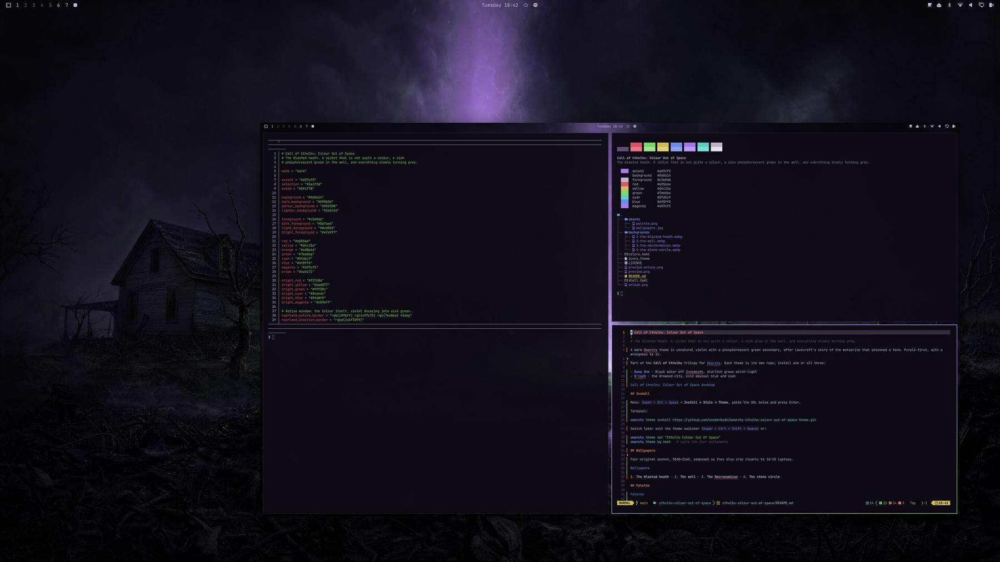
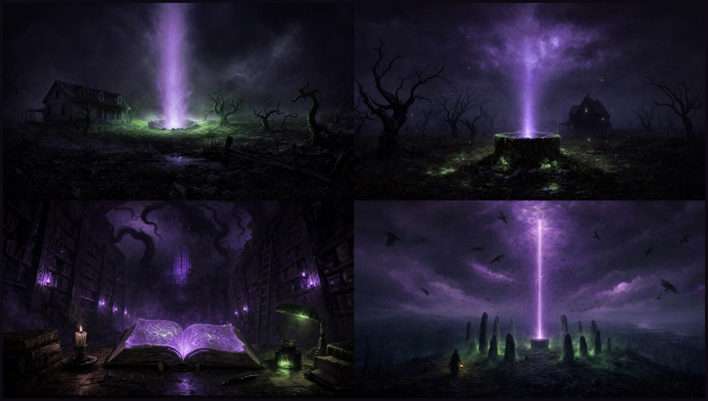
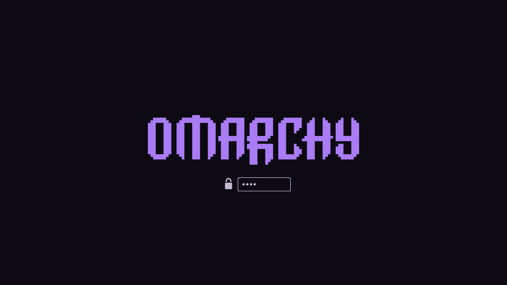

# Call of Cthulhu: Colour Out of Space

> The blasted heath. A violet that is not quite a colour, a sick glow in the well, and everything slowly turning grey.

A dark Omarchy theme in unnatural violet with a phosphorescent green secondary, after Lovecraft's story of the meteorite that poisoned a farm. Purple-first, with a wrongness to it.

Part of the **Call of Cthulhu** trilogy for [Omarchy](https://omarchy.org). Each theme is its own repo; install one or all three:

- [**Deep One**](https://github.com/sonderbydk/omarchy-cthulhu-deep-one-theme) · black water off Innsmouth, eldritch green witch-light
- [**R'lyeh**](https://github.com/sonderbydk/omarchy-cthulhu-rlyeh-theme) · the drowned city, cold abyssal blue and cyan



## Install

Menu: `Super + Alt + Space` → **Install → Style → Theme**, paste the URL below and press Enter.

Terminal:

```bash
omarchy theme install https://github.com/sonderbydk/omarchy-cthulhu-colour-out-of-space-theme.git
```

Switch later with the theme switcher (`Super + Ctrl + Shift + Space`) or:

```bash
omarchy theme set "Cthulhu Colour Out Of Space"
omarchy theme bg next   # cycle the four wallpapers
```

## Wallpapers

Four original scenes, 3840×2160, composed so they also crop cleanly to 16:10 laptops.



1. **The blasted heath** · 2. **The well** · 3. **The Necronomicon** · 4. **The stone circle**

## Palette


| Role | Hex |
|------|-----|
| Background | `#0e0a14` |
| Foreground | `#c5b9d6` |
| Accent | `#a97cf5` |
| Secondary | `#7ee06a` |

Full set in [`colors.toml`](colors.toml).

## What's included

- `colors.toml` — Omarchy renders it into every terminal (Alacritty, Ghostty, Kitty, Foot), btop, Hyprland borders, the shell, Chromium, VS Code, Neovim, Obsidian and keyboard RGB.
- `shell.toml` — translucent bar so the wallpaper shows through; menus, popups and notifications sit on the deeper background tone.
- Gradient active-window border (#a97cf5 → #7ee06a).
- Lock screen logo in the accent colour, plus `preview-unlock.png`.



- Icon theme: `Yaru-purple`.

## Credits

Wallpapers were generated with GPT Image 2 for this theme and are released under the same MIT license as the rest of the repo. Lovecraft's Mythos is public domain; the dread is all his.
